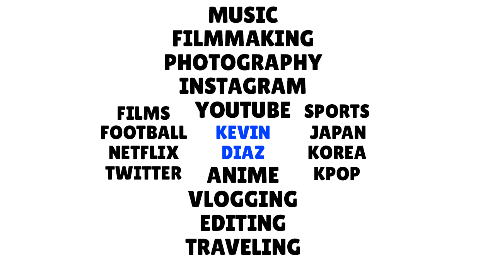
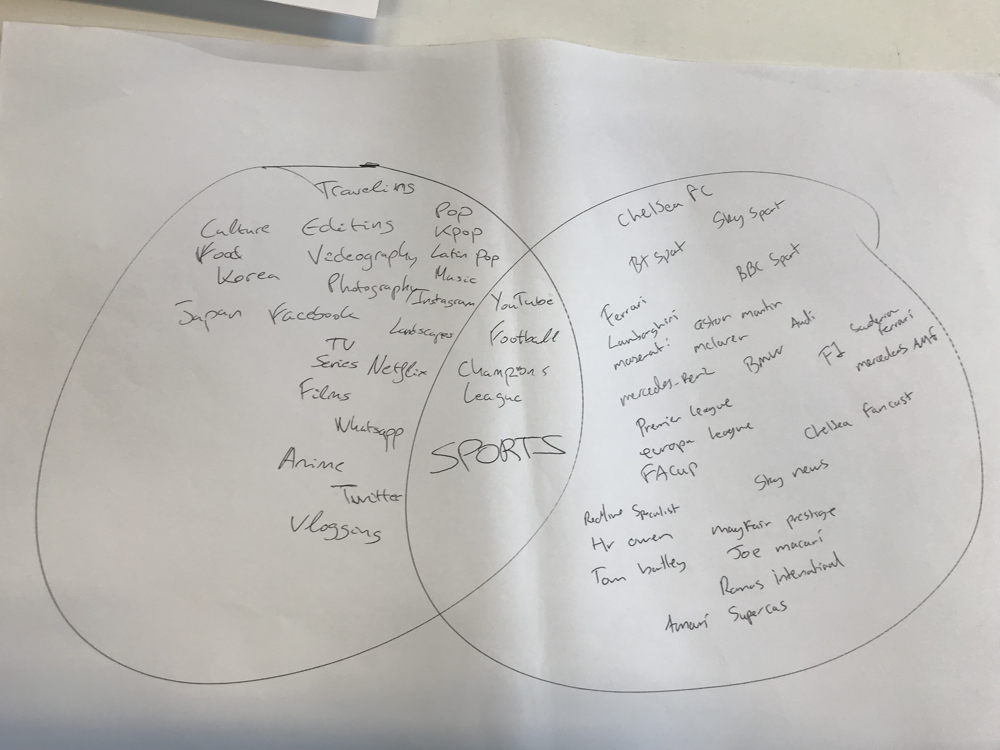
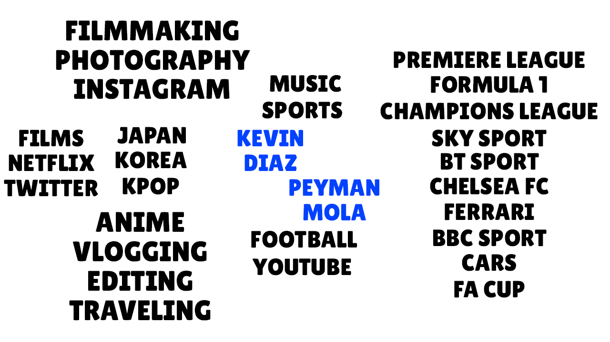
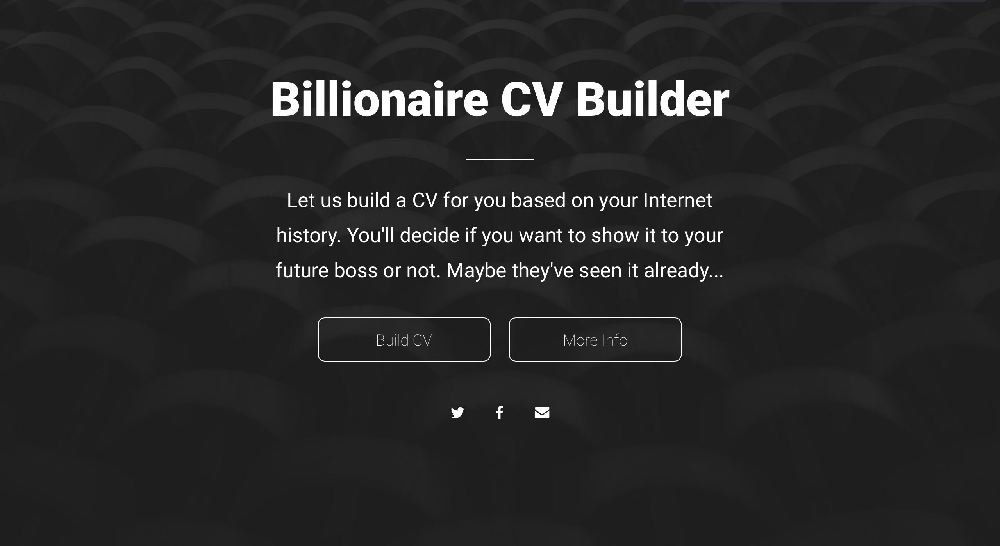

#WEB14103: Web Design Principles
**Name:** Kevin Díaz  
**Student number:** 96454416  
**Course:** Web Media Production Level 2  
**Unit Code:** WEB14204  

This is my hand-in package MarkDown file. In this file you will be able to see all my blog posts as well as the links to the different projects that I've done in this term.

##Blogs posts
* [Week 1](http://fourthfloor.raveweb.net/karboleda/2016/12/05/eyebombing-web-design-principles/ ): EyeBombing
* [Week 2](http://fourthfloor.raveweb.net/karboleda/2016/12/05/34/): OneTweet
* [Week 3](http://fourthfloor.raveweb.net/karboleda/2016/12/05/union-hack-web-design-principles/): Union Hack
* [Week 4]( http://fourthfloor.raveweb.net/karboleda/2016/12/05/formative-presen…esign-principles/ ): Formative Assessment
* [Week 5](http://fourthfloor.raveweb.net/karboleda/2016/12/05/peer-learning-web-design-principles/): Peer Learning
* [Week 7](http://fourthfloor.raveweb.net/karboleda/2016/12/05/the-webs-grain-web-design-principles/): The Web's Grain
* [Week 8](http://fourthfloor.raveweb.net/karboleda/2016/12/05/code-in-your-plate-web-design-principles/): Code in your plate
* [Week 9](http://fourthfloor.raveweb.net/karboleda/2016/12/05/css-tricks-web-design-principles/): CSS tricks

##Filter Bubbles

###Mapping your filter bubbles

**Kevin paper and digital filter bubble.**

**Kevin & Peyman Mola paper and digital filter bubbles.**

###10 (or so) bad ideas

* A browser plug-in that warns you every time you type something in the internet

* An app that lists app/websites that could potentially take more data from you

* An app/game that by answering questions could tell some of your interests

* A browser plug-in that recommends you websites depending on what you’ve searched before

* A website that when you get in plays a video that looks like TV News, the News will say that the police are looking for a serial killer, the description of the serial killer will be really similar to the person who’s watching the video. For this to happen the website will have to take data from the stuff the user has bought before in terms of clothing so the video can describe the user with clothes that the person would wear.

* A browser plugin which analyses residual files on your computer to build their own profile.

* A website that builds up a fake cv of the user depending of where they’ve been into the Internet.

###Interviews

[Interviews notes](https://docs.google.com/document/d/13cZ4-f7xku2AprcDzZ4Vqd7IbxhmdrUMtxMlN3peCgk/edit?usp=sharing)

###Idea sheet

**What is your idea called?**

Billionare CV Builder

**How does it work?**

It's a website that builds up a fake CV of the user based on their history web, cookies and social media activity.

**What do you want people to know/feel/do?**

The aim is to make people realise that the Internet is always watching us and all we post, share and search is saved for different purposes. It is really important to know that what we publish on the Internet someday can be found by our future boss, would people like that to happen?

###Paper-prototypes

[Marvelapp Paper Prototype](https://marvelapp.com/580dh15)

###Digital-prototype

[Marvelapp Digital Prototype](https://marvelapp.com/daj7934)

###User-testing feedback

###Concept video

[Concept video](https://youtu.be/PrcYiCJq52Q)

###Landing page

###Summative Presentation

[Summative Presentation]()
